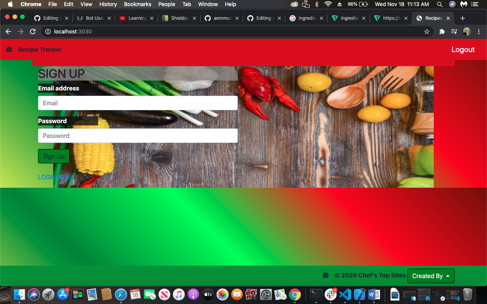
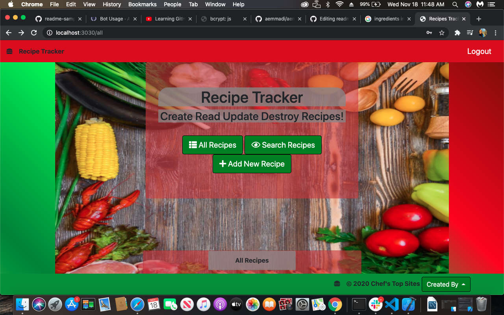
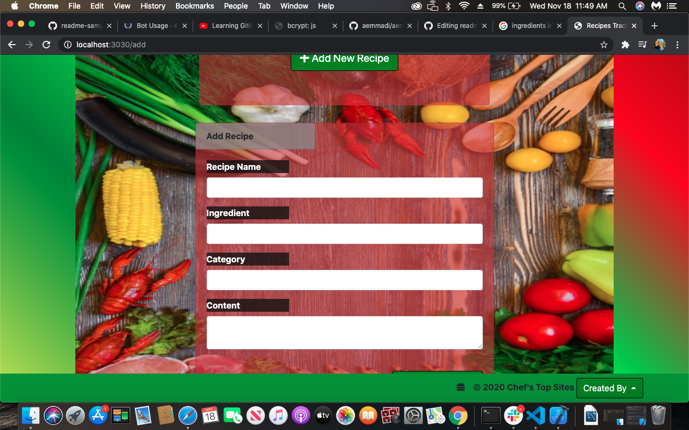
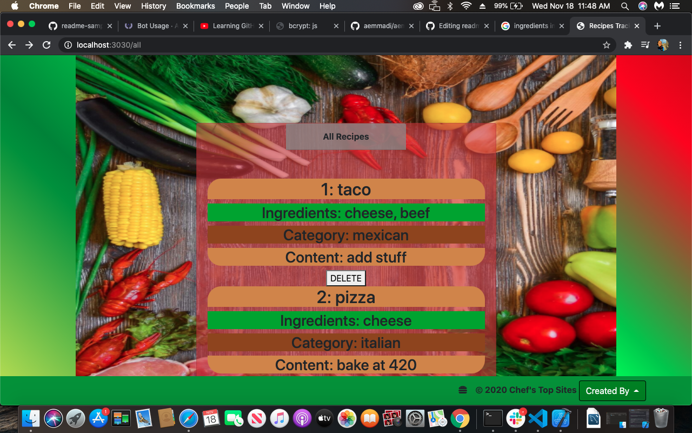
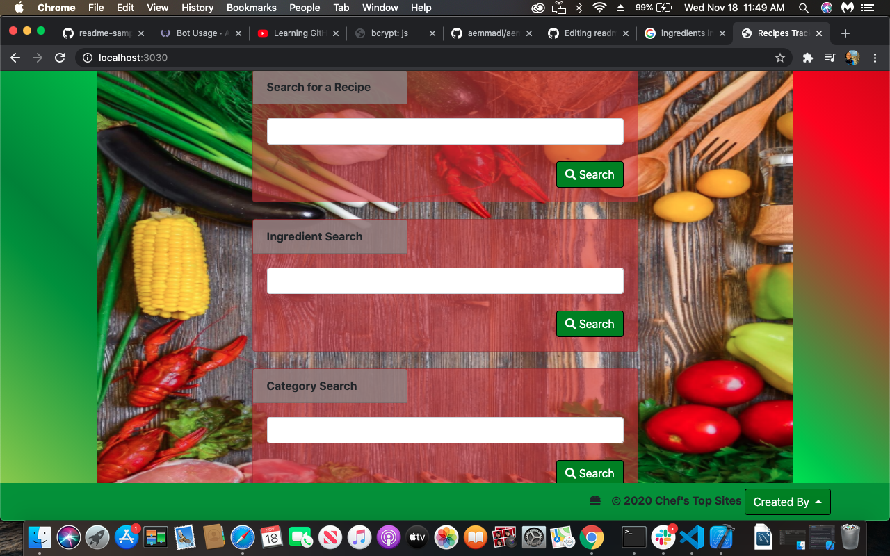

# Recipe Tracker

## Team Name
`Chef-boyz-r-dope`

## Table of contents
- [Description](#Description)
- [Installation](#Installation)
- [Usage](#Usage)
- [Screenshots](#Screenshots)
- [Contributors](#Contributors)
- [Repository Link](#Repositories)

## Description 
A colorful recipe app that allows the user to create, search and delete a recipe. A combination of express, handlebars , nodejs and much more used to create an “MVC” structure that is compliant to both programmers in the backend and clients in the frontend. You will be redirected to different pages to search, add, and view all recipes of your liking. When you add a recipe, you must supply the name of the recipe, the main ingredient, the category (culture or type) and the content, which is the instructions of preparation. Track your recipes the right way with the `chef-boys-r-dope`  **Recipe Tracker**.
## Installation

#### NPM install the following

## Usage
Use this is recipe app to track your favorite app'etizers, or any food of your liking. UI is pretty straight forward. Just follow the instructions and click away!
## Screenshots

## Contributors
[MrDawit Mr. Dawit](https://github.com/MrDawit)

[0216johnsoneric Eric](https://github.com/0216johnsoneric)

[lcalderin12 Luis Calderin](https://github.com/lcalderin12)

## Repositories
- [Heroku Deployed Link](https://recipes-tracker-hanzee.herokuapp.com/)
- [Project Repo](https://github.com/lcalderin12/Recipe-Tracker)
